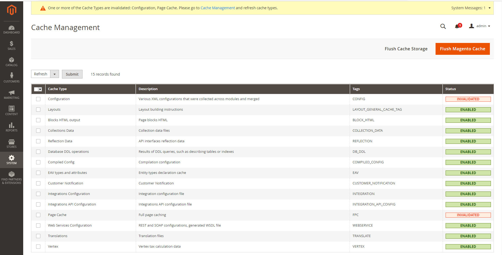
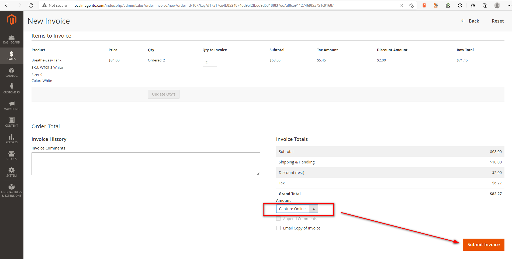
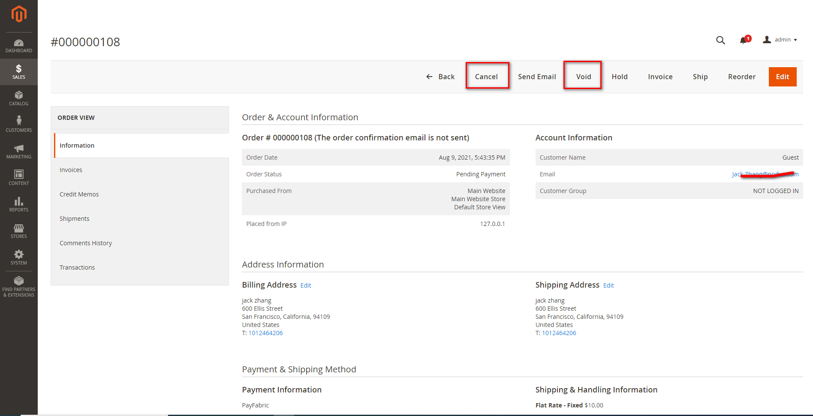
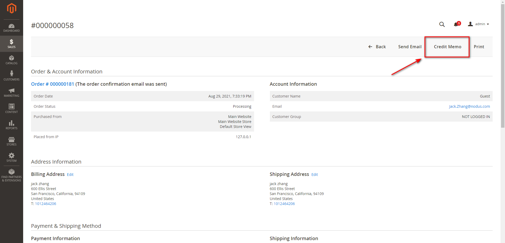
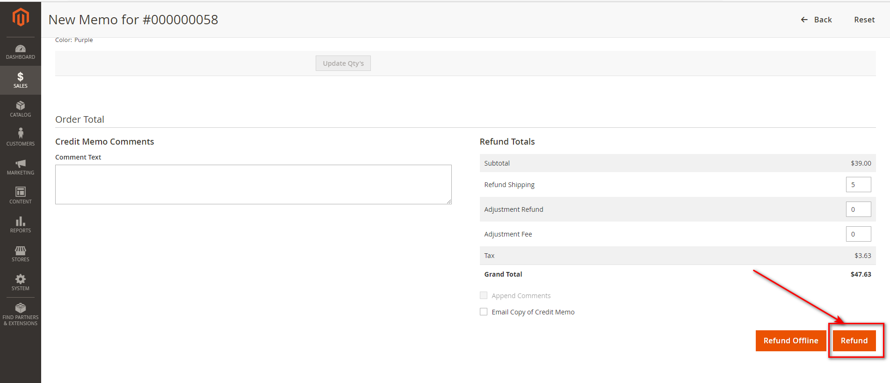

## PayFabric Gateway Plugin for Magento 2.3 or Higher
Requires Magento version 2.3 or higher.

Requires an active PayFabric account. Development can be done on a PayFabric Sandbox account. PayFabric is an EVO Payments processing platform.

## Description
PayFabric gateway extension allows you to add PayFabric payment processing capabilities into Magento 2.3 or higher without any custom coding.

## Presentation Modes

The plugin offers three modes to present the Hosted Payment Page:
- **Dialog**
- **Iframe**
- **Redirect**

## Alternative Payment Methods Supported

| Payment Method   | Dialog | Iframe | Redirect |
|------------------|--------|--------|----------|
| **Apple Pay**    | ✔      | ✘      | ✘        |
| **Google Pay**   | ✔      | ✘      | ✔        |
| **PayPal/Venmo** | ✔      | ✘      | ✘        |

## Installation
Before installing please take a full backup of your website.

### Manual Installation
1. Download the extension zip file.
2. Unzip the extension and upload the PayFabric folder to your Magento root directory app/code (create folder if not exists) via FTP/SSH.
3. Enable the extension and clear the static view files by running the command:
    ```
    bin/magento module:enable PayFabric_Payment --clear-static-content
    ```
4. Register the extension and initiate the database migrations by running the command:
    ```
    bin/magento setup:upgrade
    ```
5. Recompile the Magento project by running the command:
    ```
    bin/magento setup:di:compile
    ```
6. Clear the Magento store’s cache by running the command:
    ```
    bin/magento cache:flush
    ```

### Install with Composer
1. Run from Magento root folder:
    ```
    composer require payfabric/module-payment
    ```
2. Enable the extension and clear the static view files by running the command:
    ```
    bin/magento module:enable PayFabric_Payment --clear-static-content
    ```
3. Register the extension and initiate the database migrations by running the command:
    ```
    bin/magento setup:upgrade
    ```
4. Recompile the Magento project by running the command:
    ```
    bin/magento setup:di:compile
    ```
5. Clear the Magento store’s cache by running the command:
    ```
    bin/magento cache:flush
    ```

## Configuration
In the PayFabric Portal, prepare a device with a default gateway configured.

1. Go to Settings > Dev Central > Device Management to create a device to obtain the Device ID and Password.
2. Go to Settings > Gateway Account Configuration, click '+ New Gateway Account' if the payment gateway account is not associated to an existing PayFabric account, and then set the default gateway under Default Gateway Settings. Please refer to the user guide in [PayFabric](https://github.com/PayFabric/Portal/blob/master/PayFabric/README.md "PayFabric").
3. If you enable the eCheck Gateway Account, you can customize the eCheck payment UI to default the Entry Class to ‘WEB’ and hide it by adding the following custom JS in the PayFabric theme (please refer to [PayFabric Themes](https://github.com/PayFabric/Portal/blob/master/PayFabric/Sections/Themes.md "Themes")):
    ```javascript
    $(function(){
        $(".entryClassDiv").hide();
        $("#EntryClass option").each(function(){if(this.value == 'WEB') this.selected = true; else this.selected = false;});
    });
    ```

In your Magento account:
* Go to STORES > Configuration > Sales > Payment Methods to enter your gateway and device data.

* Select your Display Mode. When using "Iframe" as your Display Mode, you must create a theme to add the following custom JS and configure this theme as default theme in the PayFabric Portal (please refer to [PayFabric Themes](https://github.com/PayFabric/Portal/blob/master/PayFabric/Sections/Themes.md "Themes")). Please don't do that for other display modes which will affect your payment UI.
    ```javascript
    $(".BillingContent").hide();
    $("#payButton").hide();
    typeof (receiveMessage) !== "undefined" && window.removeEventListener("message", receiveMessage, false);
    var receiveMessage = function (event) {
        var data = event.data;
        if (data.match("^\\{(.+:.+,*){1,}\\}$"))  data = $.parseJSON(data);
        if (data.action == 'pay') {
            typeof (data.BillCountryCode) !== "undefined" && $("#BillCountryCode").val($("#BillCountryCode").find("option[value^=" + data.BillCountryCode + "]").val()).trigger('change');
            typeof (data.BillAddressLine1) !== "undefined" && $("#BillAddressLine1").val(data.BillAddressLine1);
            typeof (data.BillAddressLine2) !== "undefined" && $("#BillAddressLine2").val(data.BillAddressLine2);
            typeof (data.BillCityCode) !== "undefined" && $("#BillCityCode").val(data.BillCityCode);
            typeof (data.BillStateCode) !== "undefined" && $(".state").val($("#BillStateCode").find("option[value^=" + data.BillStateCode + "]").val() || data.BillStateCode);
            typeof (data.BillZipCode) !== "undefined" && $("#BillZipCode").val(data.BillZipCode);
            $("#payButton").click();
        }
    }
    window.addEventListener("message", receiveMessage, false);
    ```
* Next, select your Payment Action. Select "Sale" for a normal website purchase transaction. This is the default option and automatically executes both the authorization and capture for the transaction. The funds from this transaction will be included in your next batch settlement.
    * If you choose "Authorization", see the Capture instructions below.
* Click "Save Config".
* Go to System > Cache Management to flush Magento cache.

* When using "Authorization" as your Payment Action, you must “Capture” the transaction when the sale has been completed. If you do not “Capture” the Authorization, no funds will be settled as the transaction is not complete.
    * To capture an authorized transaction: Click on the "Invoice" button at the top right side.
    
    * On the Invoice page, scroll down to the bottom, choose "Capture Online" from the dropdown menu, and click on the "Submit Invoice" button.
    
    * When using "Authorization" as your Payment Action, you may “Void” a transaction when the order has been cancelled before being captured. Click on the "Void" or "Cancel" button at the top right side.
    
* To refund a sale or captured transaction directly on Magento: Open the invoice of the captured order.
    
    * Then click on "Credit Memo" on the top right side menu.
    
    * On the credit memo page, click "Refund".
    

## Support
Have a question or need help? Contact support@payfabric.com
